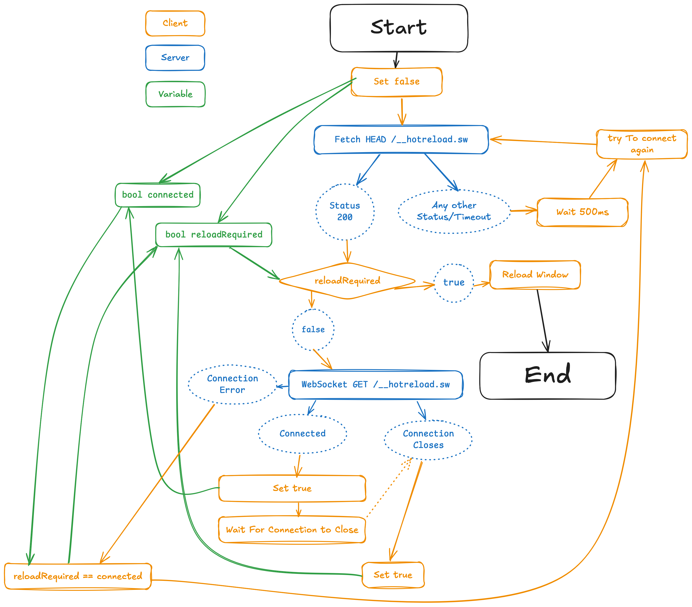

# Go - Hotreload

<!--toc:start-->
- [Go - Hotreload](#go-hotreload)
  - [Usage](#usage)
    - [ServerSide](#serverside)
    - [ClientSide](#clientside)
  - [What it does](#what-it-does)
    - [On the Server](#on-the-server)
    - [On the Client](#on-the-client)
    - [Flow](#flow)
<!--toc:end-->

a small package, that presses your Browsers `CMD+R` / `Ctrl+R` / `F5` Key for you when ever the connected server shuts down and comes back up again.

## Requirements
- Go 1.22.2 or higher
- the `golang.org/x/net package`

## Installation
```bash
go get github.com/rocco-gossmann/go_http_hotreload`
```

## Usage
### ServerSide

```go
import "github.com/rocco-gossmann/go_http_hotreload"
import "http"

func main() {
    mux := http.NewServeMux();

    // Register the routes required for the Module
    go_http_hotreload.AppendToServeMux(mux);

    // ...
    http.ListenAndServe("0.0.0.0:8888", mux)
}
```

### ClientSide

```html
<!DOCTYPE html>
<html>
	<head>
		<script defer type="text/javascript" src="/hotreload.js" ></script>
	</head>
	...
</html>
```

## What it does

### On the Server

It adds 3 new Routes to your ServeMux.

| Route                  | Description                                                                 |
| ---------------------- | --------------------------------------------------------------------------- |
| `GET /hotreload.js`    | which is used to load the required Javascript functions on the client       |
| `HEAD /__hotreload.sw` | To check if the Server has come up after it shut down                       |
| `GET /__hotreload.sw`  | To connect to the ServiceWorker, that will check when the Server shuts down |

### On the Client

It uses a combination of the `Fetch`- and `ServiceWorker`-APIs to function.

### Flow


<!---->
